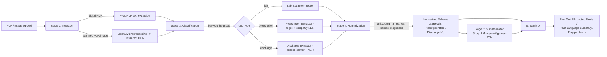

# Medical Report Information Extraction & Summarization System

A pipeline that turns unstructured medical reports (PDFs or scanned images) into
structured, normalized data and a plain-language patient summary — with a
Streamlit UI to demo it end-to-end.

## Problem statement

Medical reports (lab results, prescriptions, discharge summaries) are unstructured
text — often scanned images, not searchable PDFs — full of abbreviations, inconsistent
units, and clinical shorthand that's hard for a non-specialist to interpret quickly.
This project builds a pipeline that:

1. Reads a report regardless of whether it's a digital PDF or a scan (OCR).
2. Classifies which of three report types it is.
3. Extracts the clinically relevant fields (test results, medications, diagnoses).
4. Normalizes those fields into a consistent schema (same test/drug name and unit
   notation regardless of how the source document phrased it).
5. Generates a plain-English summary of what the report means, including what's
   abnormal or worth attention.

## Architecture



**Pipeline stages, mapped to code:**

| Stage | Folder | What it does |
|---|---|---|
| 2. Ingestion | `ingestion/` | PDF text extraction (PyMuPDF), OCR (Tesseract), image preprocessing (OpenCV) |
| 3. Classification + Extraction | `classification/`, `extraction/` | Doc-type detection, regex + NER field extraction |
| 4. Normalization | `normalization/` | Unit/drug/test-name canonicalization, dataclass schemas |
| 5. Summarization + UI | `summarization/`, `app/` | LLM-generated plain-language summary, Streamlit app |
| 6. Evaluation | `eval/` | Ground-truth annotation + precision/recall/F1 scoring |

## Tech stack

- **PDF parsing:** PyMuPDF (`fitz`)
- **OCR:** Tesseract via `pytesseract`
- **Image preprocessing:** OpenCV (`opencv-python`)
- **NER:** scispaCy (`en_core_sci_sm` biomedical model)
- **LLM summarization:** Groq API (`openai/gpt-oss-20b`)
- **UI:** Streamlit
- **Date parsing:** `python-dateutil`
- **Language:** Python 3.11

## Setup

### 1. Clone and create a virtual environment

```bash
python -m venv venv
venv\Scripts\activate        # Windows
# source venv/bin/activate   # macOS/Linux
```

### 2. Install dependencies

```bash
pip install -r requirements.txt
```

### 3. Install Tesseract OCR

This project calls the Tesseract *binary* via `pytesseract`, not a Python-only
package — it must be installed separately:

- **Windows:** download from the [UB-Mannheim Tesseract installer](https://github.com/UB-Mannheim/tesseract/wiki)
- **macOS:** `brew install tesseract`
- **Linux:** `sudo apt install tesseract-ocr`

If it's not on your system `PATH`, point `pytesseract` at the binary in
`ingestion/ocr.py`:

```python
pytesseract.pytesseract.tesseract_cmd = r"C:\path\to\tesseract.exe"
```

### 4. Set up your `.env` file

Create a `.env` file in the project root with your [Groq API key](https://console.groq.com/):

```
GROQ_API_KEY=your_key_here
```

### 5. Verify everything's working

```bash
python test_setup.py
```

This checks all imports, the Tesseract binary, the Groq API key, and the scispaCy
model, and reports `[OK]`/`[FAIL]` for each.

## Running the app

```bash
streamlit run app/streamlit_app.py
```

Open the URL Streamlit prints (usually `http://localhost:8501`), upload a PDF or
image report (sample files are in `data/samples/`), and view the four result tabs:
**Raw Text**, **Extracted Fields**, **Plain-Language Summary**, and
**Flagged/Abnormal Items**.

You can also run each pipeline stage's own test script independently:

```bash
python ingestion/test_ingestion.py
python extraction/test_extraction.py
python normalization/test_normalization.py
```

## Sample output

> _Add 1-2 screenshots here of the Streamlit app in action (e.g. the Extracted
> Fields table and the Plain-Language Summary tab) before sharing this project._

## Evaluation methodology

Evaluation compares the pipeline's extracted+normalized output against
hand-verified ground truth, scored as field-level precision/recall/F1.

1. **Generate draft ground truth** — run the pipeline on every sample and save its
   output as a starting point:

   ```bash
   python eval/annotate.py
   ```

   This writes one JSON file per sample into `eval/ground_truth/`, each marked
   `"verified": false`.

2. **Review and correct** — open each JSON file, compare it against the source
   report, fix any wrong values, and set `"verified": true`. Only verified files
   are scored — this keeps the pipeline from ever being graded against its own
   unreviewed output.

3. **Run the metrics**:

   ```bash
   python eval/metrics.py
   ```

   This reports per-sample and overall precision/recall/F1. Scoring treats each
   record (a lab result, a prescription item) as a set of `(field, value)` pairs,
   matched by canonical name (test name / drug name) — a completely missed or
   spurious record counts as a miss on every one of its fields, not just a single
   error.

Two sample ground truth files are pre-verified as a working example: a
perfect-match lab report (precision/recall/F1 = 1.0) and a prescription with one
intentionally-injected discrepancy, so `eval/metrics.py` demonstrably catches a
real mismatch rather than trivially always scoring 1.0.

## Ethics note

**All sample data in `data/samples/` is synthetic.** It was generated
programmatically for this project (fabricated names, values, and dates) and does
not contain, and was never derived from, any real patient's information. No real
protected health information (PHI) was used anywhere in building or testing this
project. If you point this pipeline at real medical records, handle them under
your organization's applicable privacy/compliance requirements (e.g. HIPAA) —
this project does not implement PHI-grade storage, access control, or audit
logging, and isn't intended for use with real patient data as-is.

## Future improvements

- Replace the hardcoded drug/lab-test lookup dictionaries in
  `normalization/term_mapper.py` with real terminology API lookups (RxNorm for
  drugs, LOINC for lab tests).
- Replace the keyword-heuristic document classifier
  (`classification/doc_type_classifier.py`) with a trained text classifier once
  enough labeled reports are available.
- Add deskewing to `ingestion/preprocess.py` for photographed (not flatbed-scanned)
  reports.
- Support multi-page reports with mixed content (e.g. a discharge summary with an
  embedded lab table).
- Expand `eval/` with a larger, more diverse ground-truth set and add per-field
  (not just per-record) error breakdowns to `eval/metrics.py`.
- Add authentication and encrypted storage if this were ever extended to handle
  real patient data.
